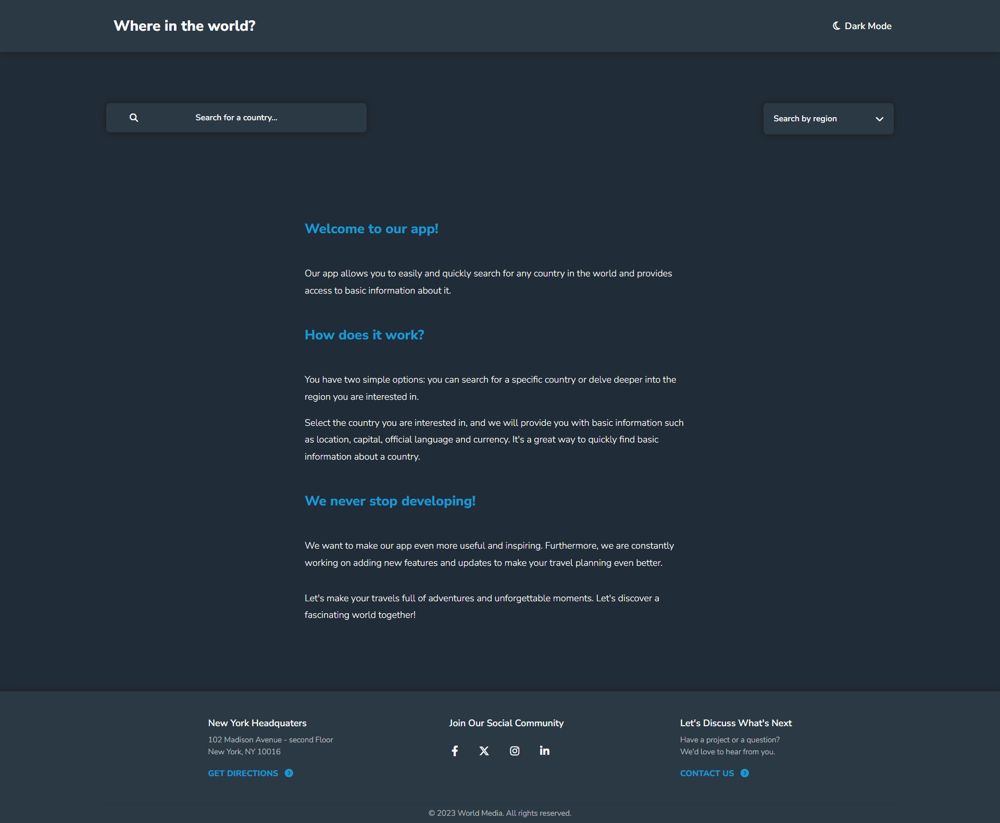
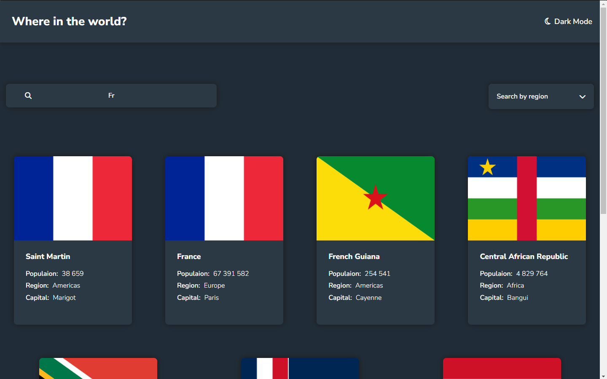
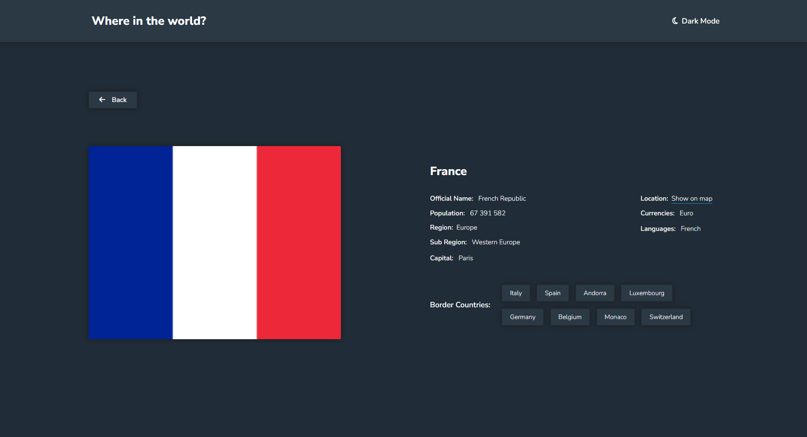

# World Explorer

World Explorer is an interactive application that allows users to explore different countries around the world.

With this tool, you can easily search for countries by name or region.

Live demo: [World Explorer](https://zig94.github.io/World-Explorer/).

## Table of Contents

- [General Info](#general-information)
- [Technologies Used](#technologies-used)
- [Screenshots](#screenshots)
- [Setup](#setup)
- [Project Status](#project-status)
- [Room for Improvement](#room-for-improvement)
- [Contact](#contact)

## General Information

- The application displays the results in the form of cards containing basic information about the country, such as name, region, population and capital.

- When you click on a country card, it is possible to get more detailed information.

- The application also allows you to move between countries by clicking on a button with the name of a neighboring country.

- The main goal of the World Explorer project is to consolidate the knowledge gained so far and to assimilate the basic concepts related to React technology and TypeScript language.

- This project provides an opportunity to explore the capabilities of these technologies and gain practical experience in their application.

## Technologies Used

- 

- 

-  version 18.2.0

-  version 5.1.6

## Screenshots

## Setup

To run this project, you must have the following dependencies installed:

- Node.js and NPM (https://nodejs.org)
- Vite (https://vitejs.dev)
- Git (https://git-scm.com)

The project has no specific requirements for Node.js and NPM versions, but I recommend using the latest stable versions to avoid compatibility issues.

### To install the project, follow these steps:

#### 1. Install Node.js:

Go to the official Node.js website - https://nodejs.org/en/download/

Select the appropriate installation file for your operating system and download it.

After downloading the setup file, run it and follow the on-screen instructions.

#### 2. Clone this repository using the Git command:

`git clone https://github.com/Zig94/World-Explorer.git`

#### 3. Navigate to the directory where you cloned the repository using the cd command.

`cd World-Explorer`

#### 4. Install all NPM dependencies

`npm install`

#### 5. Run the project:

`npm run dev`

## Project Status

Currently, the World Explorer project is in the development stage and is still undergoing improvements.

As I learn more , I will continue to work on this application, adding new information and function.

## Room for Improvement

#### 1. Room for improvement:

- Replacing the map link with an interactive map directly in the application, without having to leave the page.
- Adding more country information

#### 2. To do:

- Adding new search functions
- Sorting search results
- Creating an account
- User panel
- Creating lists of favorite countries and countries to visit

## Contact

Created by [@Max Szymański](https://github.com/Zig94) - feel free to contact me!
